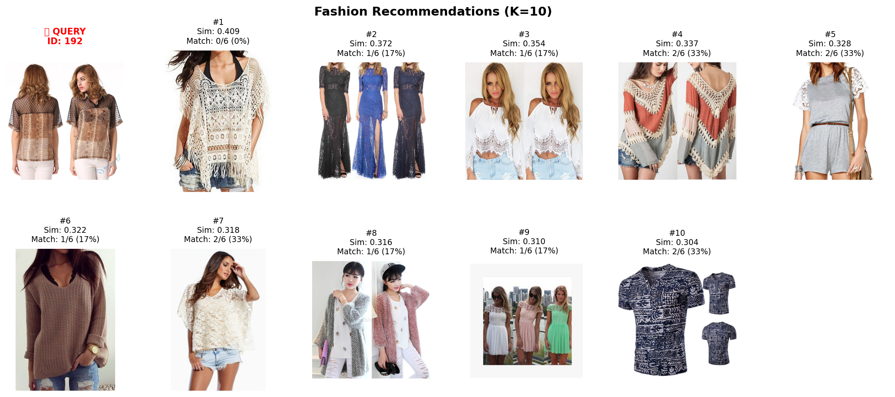
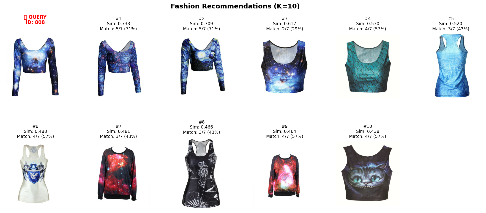
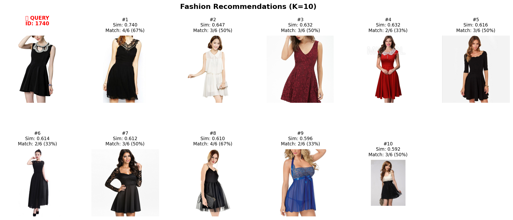
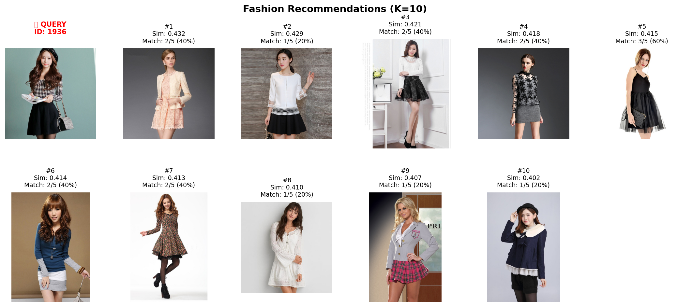

# Fashion Recommendation System

University project about deep learning-based fashion recommendation system that finds visually similar clothing items using ensemble CNNs and advanced similarity matching techniques.

##  What This Code Does

This system takes a fashion item image ( iMaterialist Fashion 2018 dataset) as input and recommends the top-K most similar items from a database. It works in 4 main steps:

1. **Feature Extraction**: Uses ResNet50 and ResNet101 CNNs to extract visual features at multiple scales (224px, 288px, 384px)
2. **Index Building**: Processes all database images, applies PCA reduction, and pre-computes a similarity matrix
3. **Similarity Search**: For a query image, finds similar items using cosine similarity with optional query expansion and category boosting
4. **Re-ranking**: Applies diversity-aware re-ranking (MMR) to provide varied recommendations

### Key Enhancements
- **Ensemble Learning**: Combines ResNet50 + ResNet101 for robust features
- **Multi-Scale Processing**: Captures both fine details (224px) and global structure (384px)
- **Spatial Attention**: Focuses on important regions like patterns and textures
- **Query Expansion**: Uses top-K results to refine the search query
- **Category Boosting**: Prioritizes items with matching category labels
- **Diversity Re-ranking**: Ensures recommendations aren't too similar to each other

##  Recommendation Examples

### Example 1: Bohemian Crochet Top (Query ID: 192)


The system finds similar crochet and lace tops with bohemian styling. Top recommendation achieved 0.409 similarity score with mixed label matches (17-33%).

### Example 2: Galaxy Print Crop Top (Query ID: 808)


Excellent pattern matching with galaxy/space prints. Top-2 recommendations achieved 71% label match with similarity scores of 0.733 and 0.709.

### Example 3: Black Lace Dress (Query ID: 1740)


Strong formal dress recognition. Top recommendation: 0.740 similarity with 67% label match. Consistent 50%+ label matches across top-5.

### Example 4: Korean Style Outfit (Query ID: 1936)


Captures color blocking and style elements. Top recommendations range from 0.432-0.429 similarity with 40-60% label matches.

##  Project Structure

```
.
├── data/
│   ├── train.json                    # Training metadata
│   ├── validation.json               # Validation metadata  
│   ├── label_descriptions.json       # Category descriptions
│   └── images/
│       ├── train/                    # Training images
│       └── validation/               # Validation images
├── indexes/
│   └── enhanced_train_index.pkl      # Pre-computed features & similarity matrix
├── enhanced_fashion_rec.py           # Main code
└── enhanced_results.csv              # Evaluation metrics output
```
_(note that in repository data and enhanced_train_index.pkl files are not included because of storage limitations on github)_

##  Output Files

The code generates two result files:

### `enhanced_results.csv`
Contains evaluation metrics for different K values:
- Recall@K: How many relevant items were found
- Precision@K: How many found items were relevant  
- NDCG@K: Ranking quality score
- MAP@K: Mean average precision

Example:
```
k,metric,mean,std,median
5,recall,0.4234,0.1123,0.4156
5,precision,0.3891,0.0987,0.3823
10,recall,0.4523,0.1234,0.4456
10,precision,0.3891,0.0987,0.3823
```

### `evaluation_results.csv`
Same metrics, potentially from different evaluation runs or configurations.

##  Quick Start

### Installation
```bash
# Install dependencies
pip install torch torchvision numpy pandas pillow scikit-learn tqdm requests

# Create directories
mkdir -p data/images/train data/images/validation indexes
```

### Dataset Setup
1. Download from [Kaggle iMaterialist Fashion 2018](https://www.kaggle.com/c/imaterialist-challenge-fashion-2018/data)
2. Place JSON files in `./data/`
3. Images will auto-download when you run the script

The script will:
1. Load dataset (prompts to download images if needed)
2. Extract features using ensemble models
3. Build similarity index → saved to `enhanced_train_index.pkl`
4. Run evaluation on 1000 validation samples
5. Save metrics to `enhanced_results.csv`
6. Show example recommendations

##  Configuration

Edit the `Config` class to customize:

```python
class Config:
    # Models to use
    MODELS = ['resnet50', 'resnet101']
    SCALES = [224, 288, 384]          # Image sizes
    
    # Feature settings
    PCA_DIM = 512                      # Reduce to 512 dimensions
    
    # Search enhancements (True/False)
    USE_ATTENTION = True               # Spatial attention
    USE_PCA = True                     # Dimensionality reduction
    USE_QUERY_EXPANSION = True         # Refine query with top results
    USE_CATEGORY_BOOST = True          # Boost same-category items
    USE_RERANKING = True               # Diversity re-ranking
    
    # Evaluation
    TOP_K_VALUES = [5, 10, 20, 50]
    N_EVAL_SAMPLES = 1000
```

##  Saved Index File

`enhanced_train_index.pkl` contains:
- **features**: Original CNN features (12,288 dimensions)
- **reduced_features**: After PCA (512 dimensions)  
- **product_ids**: Image IDs
- **product_paths**: File paths
- **label_info**: Category labels per image
- **similarity_matrix**: Pre-computed cosine similarities
- **pca_model**: Fitted PCA transformer

Load existing index instead of rebuilding:
```python
rec_system.build_index(force_rebuild=False)  # Uses cache if available
```

##  How Evaluation Works

The code evaluates by:
1. Randomly selecting N images from the database
2. Using each as a query to get top-K recommendations
3. Comparing recommended labels vs. ground truth labels
4. Computing metrics (Recall, Precision, NDCG, MAP)
5. Averaging across all queries

**Label Matching**: Uses Jaccard similarity between label sets
- Query has labels: [A, B, C]
- Recommendation has labels: [B, C, D]  
- Match score: 2/4 = 50% (2 shared / 4 total unique)

---
### Feature Pipeline
```
Input (e.g., 224×224×3)
    ↓
ResNet50 [Conv Layers] → 2048-D × 3 scales = 6,144-D
ResNet101 [Conv Layers] → 2048-D × 3 scales = 6,144-D
    ↓
Concatenate → 12,288-D
    ↓
Spatial Attention → Focus on important regions
    ↓
PCA → 512-D
    ↓
L2 Normalize
    ↓
Cosine Similarity Search
```

### Performance
- **GPU**: ~100 images/sec feature extraction (V100)
- **CPU**: ~10 images/sec
- **Query time**: <50ms after index is built
- **Index building**: ~10 min for 10K images (GPU)


---

**Expected Performance**: 15-30% improvement over baseline CNN features through ensemble and enhancement techniques.